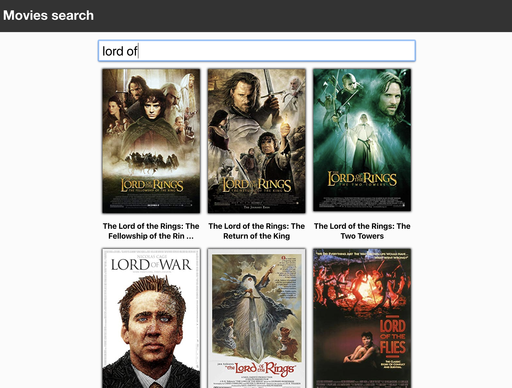
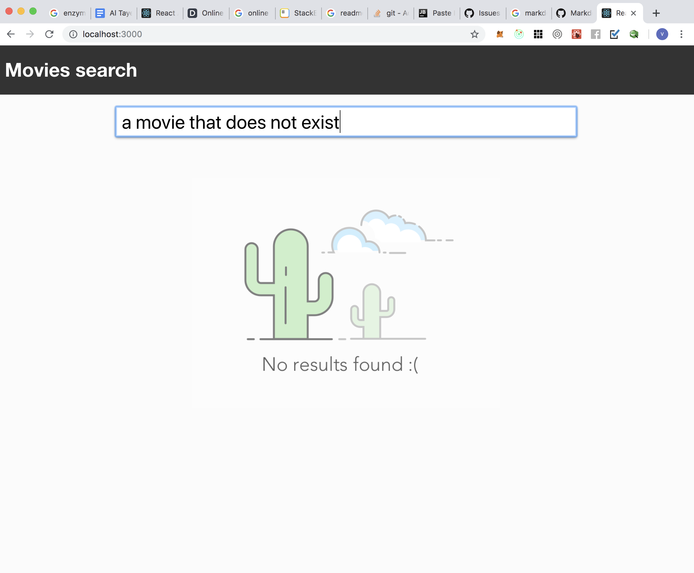
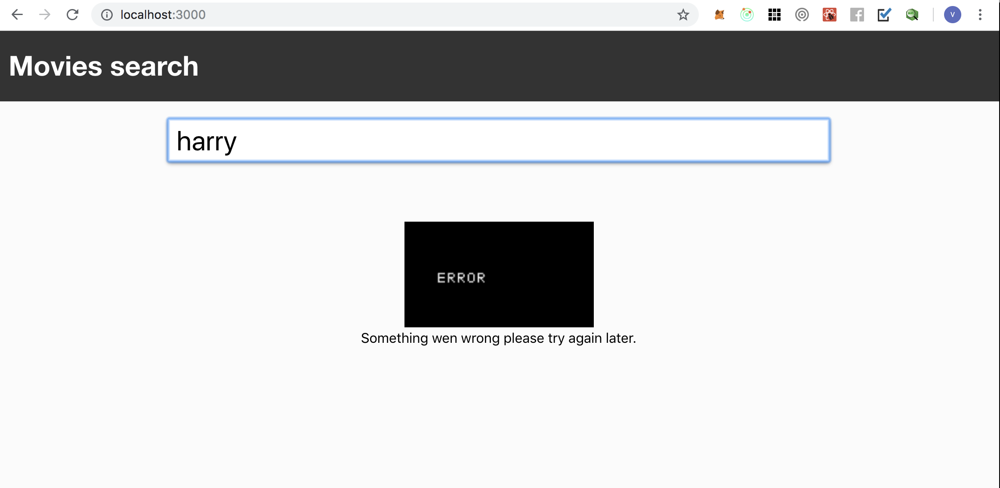

# **Fullstack Case Study**

The goal of the case study was to create a simple build a simple website that with a search box where a user will be able to search for movies by name and see the list of the results.

## Overview of the final result

#### results page:

#### cellphone layout:

#### no results page:

#### error page:

## How to run it
make sure that you have docker installed on your machine. If you don't have it you can  [download it here](https://www.docker.com/get-started).

Then at project root (the same folder that contains the docker-compose.yml file) open your terminal and run

> docker-compose up

this will automatically resolve all dependencies, build and start the application. After a few minutes you shall be able to access
the app from your own computer at [http://localhost:3000](http://localhost:3000).

## Overall architecture

The app is split in 2 main layers 

* frontend (made with react)
* backend (made with node and express)

###Backend

the backend side of the app is pretty simple, it uses an express server, with async handler (so we can use async and await)
directly at the handler and a caching middleware to cache repeated requests

the external calls are made with axios

### frontend

The front end app, runs with react + redux + rxjs(to handle async action and side effects)

rxjs was choose instead of thunk or sagas due to easiness of manipulating streams and manipulating, dispatching 
new actions and filtering payloads from it. All of the described can be done with thunks and sagas, but 
due to the fluent api and one liners rxjs is a bit more syntaticaly pleasant IMHO.

axios was choosen as our library to execute external requests, it would be possible execute the requests with
plain fetch but the cache adapter makes simpler to get the results directly from the memory in case of local caching

finally recompose was used to assemble the HOCs (again not the only way)

the components are organized in presentational (dumb) comopnents and views(containers). Only the views
are directly connected to our store, the presentational components are always pure functional components
each component tries to be as self container as possible so the component folders normaly contain its style and images

tests where implemented with jest + enzyme. A couple of tests were implemented to show concepts like
shallow rendering, mounted tests and mocks.

## How to turn it into a production ready app

right now the app is served from in dev mode with react proxy to the server, ideally a third container should
be created with a nginx image. The app container would just build the app and put it's output into a volume
the nginx container would use the same volume to serve the static assets and then act as a reverse proxy
to the server. This would allow things like load balancing and scalling the app up by adding more backend containers

##Time spent and things I would do differently

I believe that I spent around 6 hours of work to setup the docker structure and build the app. So I consider the amount
of time given a good amount. I wouldn't really change much besides of writting more and better test cases adding
linting and pretty to the server.

